# Strukturdaten

Die Strukturdaten-API ermöglicht es, Schulstrukturdaten unabhängig des Single-Sign-On an Angebote zu übertragen.
Die Schnittstelle basiert auf der [Dienste-API](https://schulconnex.de/docs/generated/openapi/dienste/schulconnex) von [Schulconnex](https://schulconnex.de/).

## Aufbau

## Für Anbieter

Im Kapitel für Anbieter wird beschrieben, wie ein Angebot an die API angeschlossen werden kann, und wie diese funktioniert.

## Für Landessysteme

Im Kapitel für Landessysteme wird beschrieben, wie ein Landessystem in die API aufgenommen werden kann.
